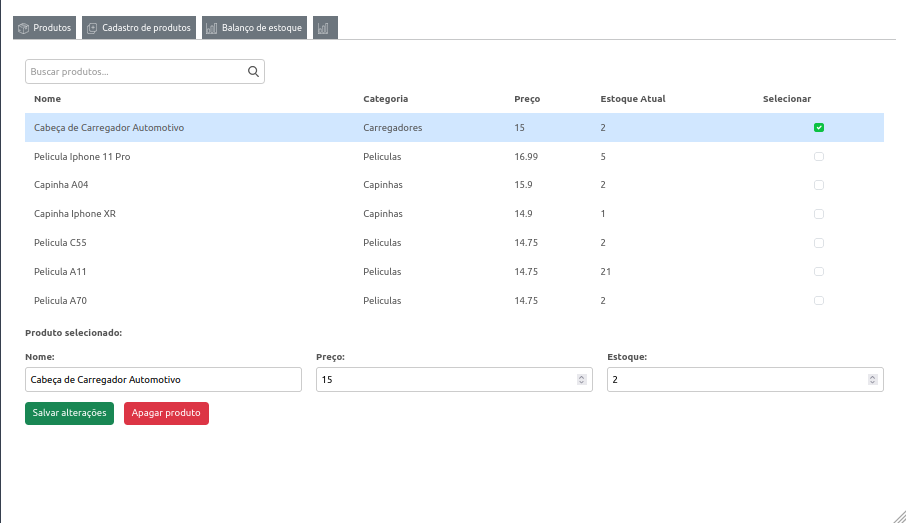

# UpGestor

**UpGestor** é um sistema eficiente de gerenciamento de estoques desenvolvido para otimizar processos em empresas de diversos setores. Com funcionalidades intuitivas, permite o cadastro, atualização e exclusão de produtos, além de gerar gráficos dinâmicos para visualização das modificações no estoque.

### Funcionalidades

- **Cadastro de Produtos**: Permite adicionar novos produtos ao estoque de forma simples e rápida.
- **Atualização de Produtos**: Atualiza as informações dos produtos existentes no estoque.
- **Exclusão de Produtos**: Remove produtos do estoque.
- **Gráficos Dinâmicos**: Visualize gráficos que mostram quantos produtos foram adicionados, removidos ou atualizados.
- **Controle Eficiente**: Facilita o controle de estoque, evitando perdas e melhorando a tomada de decisões.
- **Sistema de controle de caixa**:  Efetua vendas de produtos do estoque e organiza o fluxo de entradas e saidas.

### Tecnologias Usadas

- **Frontend**: ReactJS, JavaFX
- **Backend**: Java, Firebase
- **Banco de Dados**: Firebase, SQLite

### Empresas
- Cezar Bikes https://www.instagram.com/cezarbikemotoepecas
- C&S TECH https://www.instagram.com/c.s._.tech